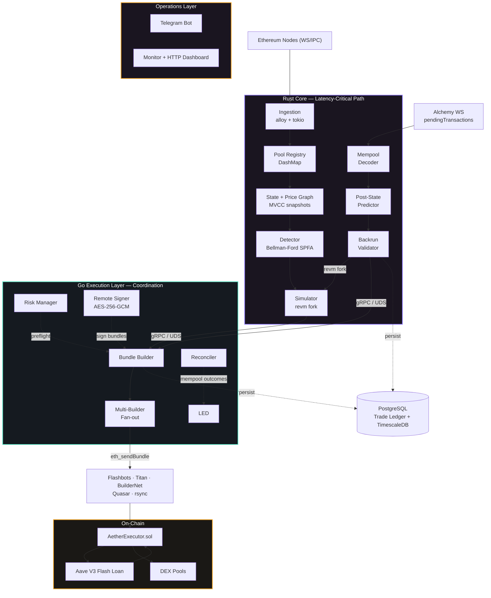
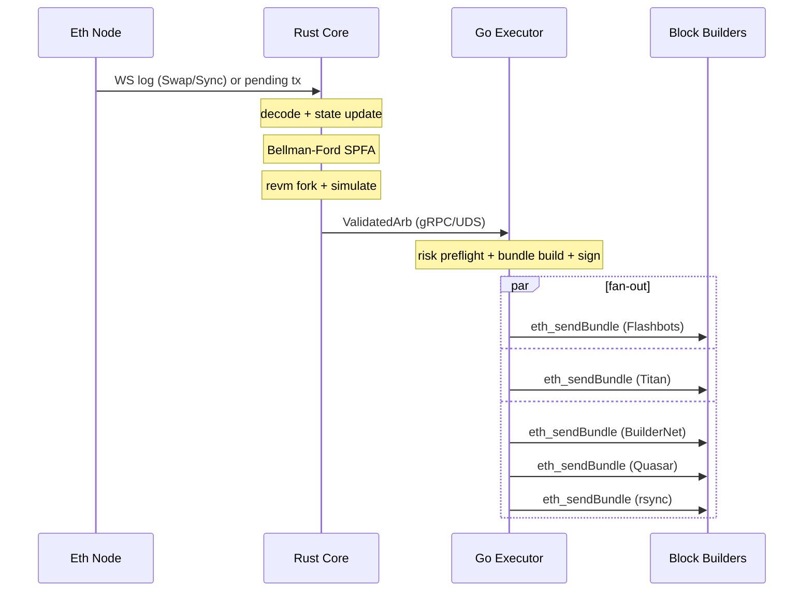
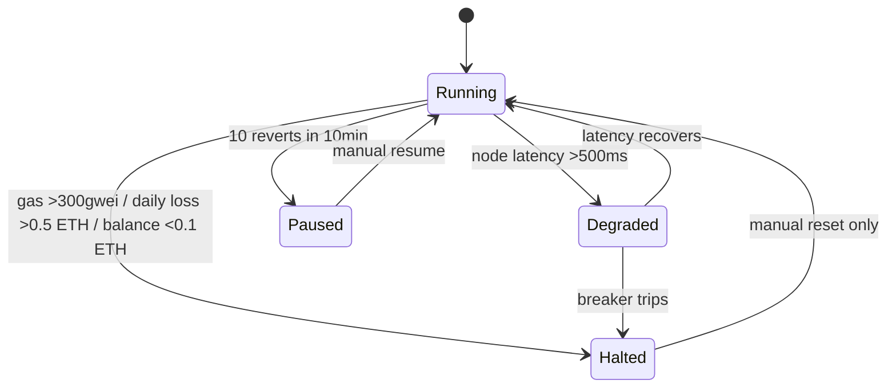

<p align="center">
  
</p>

# Aether

**Production-grade cross-DEX MEV arbitrage engine for Ethereum Mainnet.**

Aether detects and executes arbitrage opportunities across Uniswap V2/V3, SushiSwap, Curve, Balancer V2/V3, and Bancor V3. It uses a Rust core for low-latency detection and simulation, Go services for execution orchestration, and a Solidity smart contract for on-chain flash-loan-backed execution.

---

## Table of Contents

- [Features](#features)
- [Architecture](#architecture)
- [Technology Stack](#technology-stack)
- [Prerequisites](#prerequisites)
- [Installation](#installation)
- [Configuration](#configuration)
- [Environment Variables](#environment-variables)
- [Running](#running)
- [Testing](#testing)
- [Project Structure](#project-structure)
- [Mempool Backrun Mode](#mempool-backrun-mode)
- [Adding a New DEX](#adding-a-new-dex)
- [Risk Management](#risk-management)
- [Security](#security)
- [Troubleshooting](#troubleshooting)
- [License](#license)

---

## Features

- **Multi-DEX arbitrage detection** — Bellman-Ford (SPFA + SLF) negative cycle detection across 7 DEX protocols
- **Mempool backrun** — Decodes pending swaps from Alchemy `alchemy_pendingTransactions`, predicts victim post-state, and atomically backruns via `[victim_tx, arb_tx]` bundles
- **EVM simulation** — Fork-mode `revm` engine validates every opportunity before submission
- **Flash loan execution** — Aave V3 `flashLoanSimple` with no upfront capital
- **Multi-builder submission** — Fan-out to Flashbots, Titan, BuilderNet, Quasar, rsync concurrently
- **A/B builder selection** — Explore/exploit strategy with configurable exploration floor and smoothing prior
- **Risk management** — Automatic circuit breakers, position limits, system state machine (Running → Degraded → Paused → Halted)
- **Dynamic pool discovery** — Factory-event listener with TVL/volume scoring for new pool onboarding
- **Observability** — Prometheus metrics, Grafana dashboards (8), Loki logs, Tempo traces, Alertmanager, Telegram bot
- **Remote signer** — AES-256-GCM encrypted private key over Unix domain socket, zeroed on SIGTERM
- **OpenTelemetry tracing** — OTLP/gRPC export to Tempo for distributed tracing
- **Postgres trade ledger** — Non-blocking async writes with bounded channels, optional TimescaleDB hypertable
- **Redis event bus** — Pub/sub for real-time bundle, PnL, breaker, and signer health events

---

## Architecture

Aether uses a two-layer architecture: a **Rust core** handles the latency-critical detection and simulation pipeline, while **Go services** manage execution, risk, monitoring, and external integrations.

### System Overview



### Execution Flow



### Component Responsibilities

| Layer | Component | Language | Responsibility |
|---|---|---|---|
| **Core** | `aether-ingestion` | Rust | WebSocket/IPC event ingestion, multi-provider node pool, ABI event decoding |
| **Core** | `aether-pools` | Rust | 7 DEX protocol adapters with unified `Pool` trait, calldata encoding |
| **Core** | `aether-state` | Rust | Directed price graph (`-ln(rate)` edges), MVCC snapshots via `arc-swap` |
| **Core** | `aether-detector` | Rust | Bellman-Ford SPFA with SLF optimization, ternary search input optimizer |
| **Core** | `aether-simulator` | Rust | revm fork-mode simulation, bytecode disk cache (`redb`), ERC20 profit measurement |
| **Core** | `aether-discovery` | Rust | Factory-event pool discovery, TVL/volume scoring, validation |
| **Core** | `aether-grpc-server` | Rust | tonic gRPC server, main binary entry point, wiring layer |
| **Execution** | `aether-executor` | Go | Bundle construction, multi-builder fan-out, A/B strategy selection |
| **Execution** | `aether-reconciler` | Go | Mempool prediction outcome reconciliation (confirmed/dropped/replaced) |
| **Execution** | `aether-signer` | Go | Remote signing daemon, AES-256-GCM key, UDS JSON-RPC |
| **Execution** | `aether-telebot` | Go | Telegram dashboard with live metrics and admin controls |
| **Execution** | `aether-monitor` | Go | Prometheus metrics, HTTP dashboard, alerting |
| **Risk** | `internal/risk` | Go | Circuit breakers, preflight checks, system state machine, adaptive tip strategy |
| **On-Chain** | `AetherExecutor.sol` | Solidity | Flash-loan-backed multi-DEX swap router, role-based access control |

---

## Technology Stack

| Category | Technology |
|---|---|
| **Languages** | Rust 1.94.1, Go 1.26.1, Solidity 0.8.28 |
| **Async Runtime** | Tokio (Rust), goroutines (Go) |
| **Ethereum** | alloy (Rust), go-ethereum (Go) |
| **EVM Simulation** | revm (fork mode, Cancun spec) |
| **gRPC** | tonic + prost (Rust), google.golang.org/grpc (Go) |
| **Smart Contracts** | Aave V3 flash loans, OpenZeppelin (Ownable2Step, AccessControl, ReentrancyGuard) |
| **Database** | PostgreSQL 15+, TimescaleDB (optional), Redis 7 |
| **Embedded KV** | redb (bytecode disk cache) |
| **Concurrency** | DashMap, arc-swap (MVCC), bounded mpsc channels |
| **Observability** | Prometheus, Grafana, Loki, Tempo (OpenTelemetry), Alertmanager |
| **Alerting** | PagerDuty, Telegram, Discord, Slack |
| **Testing** | cargo test, go test, forge test, cargo-fuzz, Echidna, testcontainers |
| **CI/CD** | GitHub Actions (6 workflows) |
| **Deployment** | Docker Compose, Ansible, systemd |

---

## Prerequisites

| Tool | Version | Purpose |
|---|---|---|
| [Rust](https://rustup.rs/) | 1.94.1 (pinned in `rust-toolchain.toml`) | Core engine |
| [Go](https://go.dev/dl/) | 1.26.1 (in `go.mod`) | Execution services |
| [Foundry](https://getfoundry.sh/) | forge, cast, anvil | Solidity build, test, fork |
| [protoc](https://grpc.io/docs/protoc-installation/) | any recent | Protobuf compilation |
| [Docker](https://docs.docker.com/get-docker/) | 24+ with Compose v2 | Local infrastructure |
| [PostgreSQL](https://www.postgresql.org/) | 15+ | Trade ledger (optional in dev) |
| [Redis](https://redis.io/) | 7+ | Event pub/sub (optional in dev) |

---

## Installation

```bash
# Clone the repository
git clone https://github.com/aether-arb/aether.git
cd aether

# Copy environment config
cp .env.example .env
chmod 600 .env

# Edit .env — set at minimum:
#   ALCHEMY_API_KEY=<your_key>
#   ETH_RPC_URL=https://eth-mainnet.g.alchemy.com/v2/${ALCHEMY_API_KEY}

# Install Rust toolchain (if not already installed)
rustup install 1.94.1

# Build Rust core (release with LTO)
RUSTFLAGS="-C target-cpu=native" cargo build --release

# Build Go services
make build

# Build Solidity contracts
cd contracts && forge build && cd ..
```

### Quick Build (all at once)

```bash
make build
```

This builds:
- `target/release/aether-rust` — Rust core engine
- `bin/aether-executor` — Go bundle builder
- `bin/aether-monitor` — Go metrics/dashboard server
- `bin/aether-telebot` — Go Telegram bot
- `bin/aether-signer` — Go remote signing daemon

---

## Configuration

All runtime configuration lives in `config/`. Environment variables support `${VAR}` expansion in YAML files.

### Configuration Files

| File | Purpose | Hot-Reload |
|---|---|---|
| `config/pools.toml` | Pool registry — 130+ monitored DEX pools with protocol, address, tokens, fee, tier | Yes (gRPC `ReloadConfig`) |
| `config/discovery.toml` | Factory-event pool discovery service configuration | Yes |
| `config/risk.yaml` | Risk parameters, circuit breaker thresholds, position limits, system state | No |
| `config/nodes.yaml` | Ethereum node provider endpoints (Alchemy WS, local Reth IPC) | No |
| `config/builders.yaml` | Block builder API endpoints, auth, timeouts, A/B strategy params | No |
| `config/executor.yaml` | Executor contract address, expected chain ID | No |
| `config/signer.yaml` | Remote signer socket path and encrypted key file path | No |
| `config/production.toml` | Cross-service settings: Telegram, Redis, HTTP ports, alerting | No |
| `config/pools_staging.toml` | Reduced pool set for staging environment | No |
| `config/pools_shadow.toml` | Shadow-mode pool registry | No |

### Risk Parameters (`config/risk.yaml`)

| Parameter | Default | Description |
|---|---|---|
| `gas_price_halt_gwei` | 300 | Halt when gas exceeds this |
| `revert_count_halt` | 10 | Halt after N consecutive reverts in window |
| `revert_window_sec` | 600 | Rolling window for revert counting |
| `daily_loss_halt_eth` | 0.5 | Halt on daily loss exceeding this |
| `min_balance_halt_eth` | 0.1 | Halt when ETH balance drops below |
| `latency_degrade_ms` | 500 | Degrade when node latency exceeds |
| `miss_rate_alert` | 0.8 | Alert when bundle miss rate exceeds |
| `single_trade_limit_eth` | 50 | Max single trade size |
| `daily_volume_limit_eth` | 500 | Max daily volume |
| `min_profit_eth` | 0.0045 | Minimum profit threshold |
| `tip_share_range_bps` | 30–99 | Adaptive tip share bounds |

---

## Environment Variables

| Variable | Required | Default | Description |
|---|---|---|---|
| `ALCHEMY_API_KEY` | Yes | — | Alchemy API key for Ethereum RPC |
| `ETH_RPC_URL` | Yes | — | Ethereum RPC endpoint (WS preferred) |
| `RUST_LOG` | No | `info` | Rust log level |
| `AETHER_CONFIG_DIR` | No | `./config` | Config directory path |
| `GOMAXPROCS` | No | `2` | Go processor count |
| `GOGC` | No | `200` | Go GC target |
| `GRPC_ADDRESS` | No | `localhost:50051` | gRPC server address |
| `METRICS_PORT` | No | `9090` | Prometheus metrics port |
| `DASHBOARD_PORT` | No | `8080` | HTTP dashboard port |
| `SEARCHER_KEY` | For live | — | Hot-wallet private key (~0.5 ETH) |
| `DATABASE_URL` | No | — | Postgres DSN (omit for `NoopLedger`) |
| `REDIS_URL` | No | — | Redis for pub/sub events |
| `MEMPOOL_TRACKING` | No | `0` | Set `1` to enable Alchemy mempool subscription |
| `AETHER_SHADOW` | No | `0` | Set `1` for shadow mode (no submissions) |
| `AETHER_EXECUTOR_ADDRESS` | For live | — | Deployed executor contract address |
| `AETHER_SIGNER_PASSPHRASE` | For signer | — | Passphrase for signer key decryption |
| `OTEL_EXPORTER_OTLP_ENDPOINT` | No | — | OTLP/gRPC collector for Tempo |
| `SLACK_WEBHOOK_URL` | No | — | Slack alert webhook |

> **Security:** Never commit `.env`. It is git-ignored by default. For production, use the remote signer (`cmd/signer`) so `SEARCHER_KEY` never lives in an environment variable.

---

## Running

### Shadow Mode (Recommended First)

```bash
# Start in shadow mode — logs forensics without submitting bundles
AETHER_SHADOW=1 ./scripts/demo.sh
```

Shadow mode writes bundle forensics to `reports/bundles/` and disables all on-chain submissions. Run for at least 24 hours before going live.

### Docker Compose (Local Development)

```bash
docker compose -f deploy/docker/docker-compose.yml up -d
```

Starts: `aether-rust`, `aether-executor`, PostgreSQL, Redis, Prometheus, Grafana, Loki, Tempo, Alertmanager.

### Manual Start

```bash
# 1. Infrastructure
docker compose -f deploy/docker/docker-compose.yml up -d prometheus grafana loki

# 2. Rust core engine
cargo run --release --bin aether-rust

# 3. Go executor (in a separate terminal)
go run ./cmd/executor

# 4. Monitor + dashboard
go run ./cmd/monitor

# 5. Telegram bot (optional)
go run ./cmd/telebot

# 6. Remote signer (production)
go run ./cmd/signer serve
```

### Production Deployment

```bash
# Deploy via Ansible
ansible-playbook -i deploy/ansible/inventory.yml deploy/ansible/playbook.yml

# Or via deploy script
./scripts/deploy.sh deploy production
./scripts/deploy.sh status production
```

### Startup Scripts

| Script | Description |
|---|---|
| `scripts/demo.sh` | Full 1-day shadow demo with all services, auto-restart, live Postgres polling |
| `scripts/start.sh` | Simplified dev start with PID tracking and cleanup |
| `scripts/deploy.sh` | Build, test, deploy automation for staging/production |

---

## Testing

### Test Commands

```bash
# All off-chain tests (Go + Rust + integration)
make test

# Go unit tests with coverage
make test-offchain-go

# Rust unit tests
make test-offchain-rust

# Cross-language gRPC integration tests
make test-offchain-integration

# Rust fuzz targets (5 targets, 30s each)
make test-offchain-fuzz

# Historical replay tests
make test-offchain-replay

# Full E2E pipeline test
make test-offchain-e2e

# Coverage report (Go + Rust)
make test-offchain-coverage

# Solidity tests
cd contracts && forge test -vvv

# Solidity fuzz tests (1000 runs)
cd contracts && forge test --fuzz-runs 1000 -vvv

# Solidity invariant tests
cd contracts && forge test --match-path "test/*.invariant.t.sol" -vvv

# Fork tests (requires ETH_RPC_URL)
./scripts/run_fork_tests.sh
```

### Test Coverage Targets

| Layer | Minimum | Tool |
|---|---|---|
| Go | 96% | `go test -coverprofile` |
| Rust | 98% | `cargo-tarpaulin` |
| Solidity | 98% | `forge coverage` |

### Test Types

| Type | Scope | Tool |
|---|---|---|
| Unit tests | Rust crates, Go packages, Solidity contracts | `cargo test`, `go test`, `forge test` |
| Integration tests | Cross-language gRPC, Postgres, full pipeline | Go integration + Rust integration crate |
| Fork tests | Mainnet fork via Anvil | Foundry fork tests |
| Invariant tests | Solidity post-condition safety properties | Foundry invariant runner |
| Fuzz tests | 12 Rust libfuzzer targets + Solidity fuzz | `cargo-fuzz`, `forge test --fuzz` |
| Echidna | Formal property-based Solidity fuzzing | Echidna |
| Load tests | Detection cycle simulation | Go load test suite |
| E2E tests | Full pipeline against Docker Compose stack | Go E2E test suite |

---

## Project Structure

```
aether/
├── Cargo.toml                        # Rust workspace root (9 crates)
├── go.mod                            # Go module (github.com/aether-arb/aether)
├── rust-toolchain.toml               # Rust 1.94.1 pinned
├── Makefile                          # Build + test targets
├── proto/
│   └── aether.proto                  # gRPC contract (ArbService, HealthService, ControlService)
│
├── crates/                           # ── Rust Core ──
│   ├── common/                       # Shared types, errors, DB schema, protocol constants
│   ├── ingestion/                    # WS event + Alchemy mempool subscription, node pool
│   ├── pools/                        # 7 DEX adapters (V2, V3, SushiSwap, Curve, Balancer, Bancor)
│   ├── state/                        # Price graph, MVCC snapshots, token index, hot cache
│   ├── detector/                     # Bellman-Ford SPFA + SLF, ternary search optimizer
│   ├── simulator/                    # revm fork sim, bytecode cache, mempool backrun validator
│   ├── discovery/                    # Factory-event pool discovery + scoring + validation
│   ├── grpc-server/                  # tonic gRPC server + 3 binaries (rust, replay, profit-scorer)
│   └── integration-tests/            # Cross-crate integration test suite
│
├── cmd/                              # ── Go Services ──
│   ├── executor/                     # Bundle construction + multi-builder submission
│   ├── monitor/                      # Prometheus metrics, HTTP dashboard, alerting
│   ├── reconciler/                   # Mempool prediction outcome reconciler
│   ├── signer/                       # Remote signing daemon (AES-256-GCM, UDS)
│   └── telebot/                      # Telegram bot with live metrics
│
├── internal/                         # ── Go Shared Packages ──
│   ├── config/                       # YAML/TOML config loading + validation
│   ├── db/                           # Postgres trade/mempool ledger + TimescaleDB metrics
│   ├── grpc/                         # gRPC client to Rust core (UDS/TCP + TLS)
│   ├── pb/                           # Generated protobuf bindings
│   ├── risk/                         # Circuit breakers, preflight, state machine, tip strategy
│   ├── signer/                       # Remote signer client + memory guard (mlock)
│   ├── tracing/                      # OpenTelemetry tracer initialization
│   ├── events/                       # Redis pub/sub publisher + subscriber
│   ├── strategy/                     # A/B builder selection (explore/exploit)
│   └── testutil/                     # Test fixtures + mock gRPC server
│
├── contracts/                        # ── Solidity ──
│   ├── src/AetherExecutor.sol        # Flash-loan receiver + multi-DEX swap router (987 lines)
│   ├── test/                         # 80+ unit tests, fork tests, invariant tests, Echidna harness
│   └── script/Deploy.s.sol           # Foundry deployment script
│
├── config/                           # Runtime configuration (YAML/TOML)
├── migrations/                       # PostgreSQL schema (8 migrations: ledger, mempool, metrics, views)
├── fuzz/                             # 12 Rust fuzz targets (libfuzzer)
├── tests/                            # Go integration, E2E, load tests
├── scripts/                          # Deploy, test, monitoring, key management scripts
├── deploy/                           # Docker Compose, Dockerfiles, Ansible, systemd, Grafana dashboards
├── docs/                             # Architecture, runbooks, incident response, research
└── docs-site/                        # Documentation website source
```

---

## Mempool Backrun Mode

Alongside block-driven cyclic arbitrage, Aether runs a pending-transaction backrun strategy:

1. **Decode pending swaps** — Alchemy `pendingTransactions` subscription feeds a calldata decoder supporting Uniswap V2/V3 routers, SushiSwap, Universal Router, Balancer V2 Vault, Bancor V3, and Curve pool-direct flows.

2. **Predict victim post-state** — Affected pools are advanced past the victim swap either analytically (V2 constant product, Curve, Bancor) or by replaying the swap in `revm` (Balancer, UniV3), producing the reserves the block will actually settle with.

3. **Validate the backrun** — The detector/simulator search for a profitable backrun against the predicted state, with the `AetherExecutor` bytecode injected into the `revm` `CacheDB` so the flash-loan path is exercised.

4. **Bundle atomically** — The bundle is `[victim_raw_tx, arb_tx]`, where `victim_raw_tx` is the victim's raw signed transaction captured from the mempool. The backrun only lands if the victim lands.

### Backrun Mode Configuration

| Environment Variable | Values | Description |
|---|---|---|
| `AETHER_BACKRUN_MODE` | `off`, `shadow_only`, `shadow_and_live`, `live_only` | Controls backrun submission behavior |
| `MEMPOOL_TRACKING` | `1` / `0` | Enables Alchemy mempool subscription |
| `AETHER_SHADOW` | `1` / `0` | Global shadow mode |

---

## Adding a New DEX

1. Implement the `Pool` trait in `crates/pools/src/<new_dex>.rs`
2. Add event signature to `crates/ingestion/src/event_decoder.rs`
3. Add protocol variant to `ProtocolType` in `crates/common/src/types.rs`
4. Add swap routing in `contracts/src/AetherExecutor.sol` `_executeSwap()`
5. Add gas estimate in `crates/detector/src/gas.rs`
6. Add pool config entry in `config/pools.toml`
7. (Optional) Add calldata decoder in `crates/pools/src/router_decoder.rs`

No changes needed to detection or execution logic.

---

## Risk Management

Automatic circuit breakers enforce system safety:

| Condition | Threshold | Action |
|---|---|---|
| Gas price | >300 gwei | **HALT** |
| Consecutive reverts | 10 in 10min | **PAUSE** |
| Daily loss | >0.5 ETH | **HALT** |
| ETH balance | <0.1 ETH | **HALT** |
| Node latency | >500ms | **DEGRADE** |
| Bundle miss rate | >80% in 1h | **ALERT** |
| Competitive reverts | >90% | **ALERT** |

### System State Machine



### Adaptive Tip Strategy

The tip share adjusts dynamically based on inclusion rate:
- Inclusion rate <50% → increase tip (up to 95%)
- Inclusion rate >80% → decrease tip (down to 50%)
- Clamped to configurable min/max bounds

---

## Security

| Measure | Description |
|---|---|
| **Flash-loan execution** | No upfront capital at risk; profits extracted within single atomic transaction |
| **Minimal hot-wallet balance** | Searcher EOA holds ~0.5 ETH for gas only |
| **Encrypted private keys** | AES-256-GCM encryption at rest, decrypted only in signer process memory |
| **Memory locking** | Signer uses `mlock()` to prevent key material from being swapped to disk |
| **Zero-on-exit** | Signer zeroes key memory on SIGTERM before exit |
| **Socket permissions** | UDS socket created with `0600` permissions |
| **Role-based access** | `AetherExecutor` uses OpenZeppelin `Ownable2Step` + `AccessControl` (EXECUTOR_ROLE, PAUSER_ROLE) |
| **Timelocked router updates** | 24h/48h delays prevent instantaneous DEX router changes |
| **Per-protocol kill switches** | Individual protocols can be disabled without affecting others |
| **Ownership renunciation disabled** | `renounceOwnership()` permanently blocked |
| **Network hardening** | iptables + WireGuard VPN for production deployments |
| **`.env` git-ignored** | Secret variables never committed to version control |

---

## Monitoring

### Prometheus Metrics

Key metrics exposed on port 9090 (`/metrics`):

| Metric | Description |
|---|---|
| `aether_opportunities_detected_total` | Arbitrage opportunities found |
| `aether_mempool_pending_arb_candidates_total` | Mempool backrun candidates |
| `aether_bundles_included_total` | Bundles included on-chain |
| `aether_detection_latency_ms` | Detection pipeline latency |
| `aether_end_to_end_latency_ms` | Full pipeline latency |
| `aether_gas_price_gwei` | Current gas price |
| `aether_daily_pnl_eth` | Daily profit and loss |
| `aether_eth_balance` | Searcher wallet balance |
| `aether_decode_errors_total` | Calldata decode failures |
| `aether_ledger_writes_total` | Trade ledger write count |
| `aether_ledger_drops_total` | Dropped writes (saturation) |
| `aether_mempool_reconciled_total` | Mempool predictions reconciled |

### Grafana Dashboards

8 pre-configured dashboards in `deploy/docker/grafana/dashboards/`:

| Dashboard | Focus |
|---|---|
| Overview | High-level system health |
| Mempool | Pending tx pipeline metrics |
| Builders | Per-builder inclusion rates |
| Latency | End-to-end pipeline timing |
| Risk | Circuit breaker states |
| SLI | Service level indicators |
| Cache | Cache hit rates and sizes |
| Backrun Funnel | Mempool backrun pipeline funnel |

### Alerting

Alerts via PagerDuty, Telegram, Discord, and Slack. Configuration in `config/production.toml` under `[monitor.alerting]`.

---

## Troubleshooting

### Common Issues

| Problem | Solution |
|---|---|
| `GRPC_ADDRESS` connection refused | Ensure `aether-rust` is running before starting `aether-executor` |
| `DATABASE_URL` not set | Trade ledger uses `NoopLedger` — writes are discarded (not an error in dev) |
| `REDIS_URL` not set | Event pub/sub is disabled — Telegram bot and Redis events won't work |
| Build fails with Rust version error | Run `rustup install 1.94.1` — toolchain is pinned in `rust-toolchain.toml` |
| Stale socket file | Delete `/run/aether/signer.sock` if signer crashed without cleanup |
| `config/pools.toml` parse error | Ensure all `${VAR}` references in YAML have corresponding env vars or defaults |
| Gas price halt | System halts when gas >300 gwei — adjust `risk.yaml` or wait for gas to drop |
| Bundle miss rate >80% | Check builder endpoints in `builders.yaml` and network connectivity |

### Logs

```bash
# Rust core with JSON structured logging
RUST_LOG=debug LOG_FORMAT=json cargo run --release --bin aether-rust

# Go executor logs
go run ./cmd/executor 2>&1 | tee logs/executor.log

# View Grafana logs (if using Docker Compose)
open http://localhost:3000
```

### Health Checks

```bash
# gRPC health check
grpcurl -plaintext localhost:50051 aether.HealthService/Check

# Prometheus metrics
curl http://localhost:9090/metrics

# PostgreSQL ledger status
psql $DATABASE_URL -c "SELECT COUNT(*) FROM arbs WHERE ts > now() - interval '1 hour';"
```

---

## License

MIT License. See [LICENSE](LICENSE) for details.
