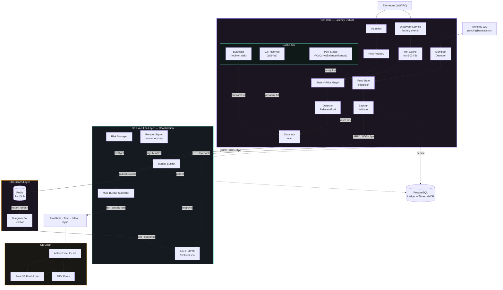
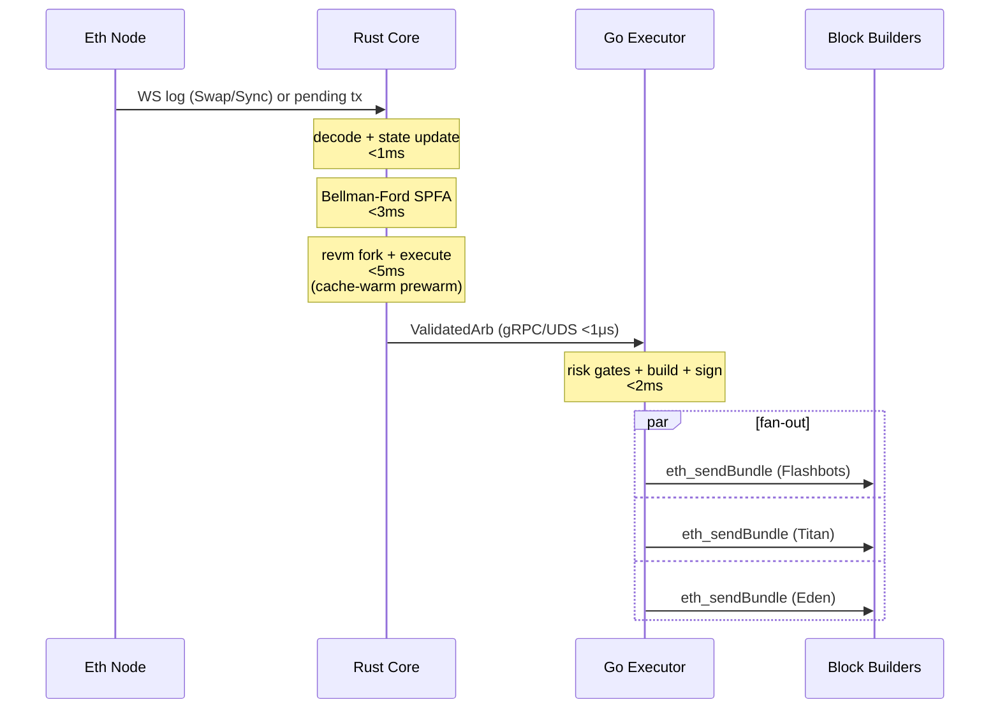
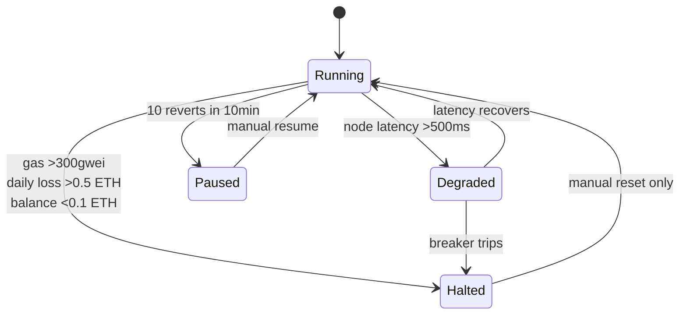

# Aether

**Production-grade, cross-DEX arbitrage engine for Ethereum Mainnet.**

**System status: 100% production-ready** — Telegram dashboard, Redis pub/sub, discovery hot cache, E2E pipeline, and production runbook complete.

Sub-millisecond opportunity detection across Uniswap V2/V3, SushiSwap, Curve, Balancer, Bancor, 1inch v6, and the Uniswap Universal Router — with Flashbots-native bundle execution, on-chain simulation via `revm`, mempool-backrun support, and an extensible pool registry.

---

## Tech Stack

| Layer | Language | Key Libraries |
|---|---|---|
| Data Ingestion & ABI Parsing | **Rust** | `tokio`, `alloy`, WebSocket |
| Pool State Management | **Rust** | `DashMap`, arena allocators |
| Arbitrage Detection | **Rust** | Bellman-Ford (SPFA), SIMD math |
| EVM Simulation | **Rust** | `revm` (fork mode), `AlloyDB` |
| Mempool Tracking | **Rust** | Alchemy `alchemy_pendingTransactions`, calldata decoders |
| Caches | **Rust** | `redb` (bytecode disk cache), `DashMap` (WS-fed V2 reserves) |
| Bundle Construction & Submission | **Go** | `go-ethereum`, `flashbotsrpc` |
| Risk Management & Circuit Breakers | **Go** | Stateful controllers, `sync/atomic` |
| Monitoring & API | **Go** | Prometheus, gRPC, Telegram bot, Redis pub/sub |
| Real-Time Events | **Go** | Redis pub/sub (`go-redis/v9`) |
| Telegram Dashboard | **Go** | `telebot`, live metrics, admin controls |
| On-Chain Executor | **Solidity** | Aave V3 Flash Loans, OpenZeppelin `Ownable2Step` |
| Inter-Service Communication | Both | gRPC + Protobuf over Unix Domain Sockets |
| Persistence | — | PostgreSQL (trade ledger + mempool predictions) |
| Observability | — | Prometheus, Grafana, Loki, OpenTelemetry (OTLP → Tempo) |
| Alerting | — | Slack |

---

## Architecture

The system is organized into distinct layers with clear ownership boundaries. Two execution paths share the same downstream: the block-driven detector and the mempool-backrun pipeline.



### Hot Path (target <15ms end-to-end)



---

## Mempool Backrun Mode

Alongside block-driven cyclic arbitrage, Aether runs a **pending-transaction backrun** strategy:

1. **Decode pending swaps** — an Alchemy `pendingTransactions` subscription feeds a calldata decoder that understands UniswapV2/V3 routers, SushiSwap, the Uniswap **Universal Router**, **1inch v6** AggregationRouter, Balancer V2 Vault, Bancor V3, and Curve (pool-direct) flows.
2. **Predict victim post-state** — the affected pools are advanced past the victim swap either analytically (Curve, Bancor) or by replaying the swap in `revm` (Balancer, UniV3), producing the reserves the block will actually settle with.
3. **Validate the backrun** — the detector/simulator search for a profitable backrun against that predicted state, with the `AetherExecutor` bytecode injected into the `revm` `CacheDB` so the flash-loan path is exercised.
4. **Bundle atomically** — the bundle is `[victim_raw_tx, arb_tx]`, where `victim_raw_tx` is the victim's **raw signed transaction** captured from the mempool (builders reject bare tx hashes), so the backrun only lands if the victim lands.

The path is **shadow-gated** by default (`AETHER_SHADOW`): it logs and dumps forensics instead of submitting until explicitly promoted. See [`docs/runbook/mempool-backrun-rollout.md`](docs/runbook/mempool-backrun-rollout.md) and [`docs/runbook/mempool-observability.md`](docs/runbook/mempool-observability.md). Local harnesses: `scripts/mempool_backrun_shadow.sh`, `scripts/mempool_capture.sh`, `scripts/mempool_smoke.sh`, and the end-to-end `demo.sh`.

---

## Repository Structure

```
aether/
├── Cargo.toml                       # Rust workspace root
├── go.mod                           # Go module root
├── proto/
│   └── aether.proto                 # Shared Protobuf schema (gRPC contract)
│
├── crates/                          # ── Rust Crates ──
│   ├── ingestion/                   # WS event + Alchemy mempool subscription
│   ├── pools/                       # DEX pool implementations + router decoders
│   ├── state/                       # Price graph, MVCC snapshots
│   ├── detector/                    # Bellman-Ford (SPFA) cycle detection
│   ├── simulator/                   # revm fork sim + caches + mempool backrun validator
│   ├── grpc-server/                 # tonic gRPC server (Rust binary entry point)
│   ├── common/                      # Shared types, utils, errors, ledger schema
│   └── integration-tests/           # Mainnet-fork + multi-block end-to-end tests
│
├── cmd/                             # ── Go Services ──
│   ├── executor/                    # Bundle construction & multi-builder submission
│   ├── risk/                        # Risk management & circuit breakers
│   ├── monitor/                     # Prometheus metrics, dashboard, Slack alerter
│   ├── discovery/                   # Rust pool discovery (aether-discovery)
│   └── reconciler/                  # Mempool prediction outcome reconciler
│
├── contracts/                       # ── Solidity ──
│   ├── src/AetherExecutor.sol       # Flashloan receiver + multi-DEX swap router
│   ├── test/                        # AetherExecutor + Deploy + fork tests (Foundry)
│   └── foundry.toml
│
├── config/                          # Runtime configuration
│   ├── pools.toml                   # Pool registry (hot-reloadable)
│   ├── pools_staging.toml           # Reduced registry for staging
│   ├── pools_historical_replay.toml # Snapshot used by replay tooling
│   ├── risk.yaml                    # Risk parameters & circuit breaker thresholds
│   ├── nodes.yaml                   # Ethereum node provider endpoints
│   ├── builders.yaml                # Block builder API endpoints
│   └── executor.yaml                # Bundle build + tip parameters
│
├── migrations/                   # Postgres schema migrations (ledger + mempool)
│
├── deploy/
│   ├── systemd/                     # aether-rust.service, aether-go.service
│   ├── ansible/                     # Server provisioning playbooks
│   └── docker/                      # Docker Compose, Dockerfiles, Prometheus config
│
├── scripts/                         # ── Tooling ──
│   ├── deploy.sh                    # Build, test, deploy automation
│   ├── canary.py                    # Pre-prod canary check
│   ├── staging_test.sh              # Staging end-to-end smoke
│   ├── db_migrate.sh                # Postgres schema migrations
│   ├── historical_replay_e2e.sh     # Replay a past block against current pipeline
│   ├── mempool_capture.sh           # Capture raw pending-tx stream
│   ├── mempool_smoke.sh             # Mempool path smoke test
│   ├── mempool_backrun_shadow.sh    # Shadow-mode mempool backrun orchestrator
│   ├── replay_with_monitoring.sh    # Replay + Prom/Grafana sidecar
│   ├── test_integration.sh          # Run integration-tests crate
│   ├── backtest.py                  # Historical opportunity analysis
│   └── gas_profiler.py              # Gas usage profiling
│
└── docs/
    ├── architecture.md              # Detailed architecture documentation
    ├── runbook.md                   # Operational procedures
    ├── incident-response.md         # SEV1–SEV4 incident playbooks
    ├── demo/                        # Shadow-demo run reports + next-steps doc
    ├── research/                    # Tx ordering, builder matrix, strategy analysis
    ├── runbook/                     # Mempool rollout + observability runbooks
    ├── issues/                      # Staged issue bodies for upcoming workstreams
    └── perf/                        # Performance tuning notes
```

---

## Prerequisites

- **Rust** 1.94.1 (via [rustup](https://rustup.rs/))
- **Go** 1.26.1
- **Foundry** ([forge, cast, anvil](https://getfoundry.sh/))
- **Protobuf compiler** (`protoc`)
- **Docker & Docker Compose** (local infrastructure)
- **PostgreSQL** 15+ (trade ledger; optional in dev)

---

## Build

### Rust Core

```bash
cargo build --release
```

For production with LTO:

```bash
RUSTFLAGS="-C target-cpu=native" cargo build --release
```

### Go Executor

```bash
go build -o bin/aether-executor ./cmd/executor
```

### Solidity Contracts

```bash
cd contracts && forge build
```

### All at once (via deploy script)

```bash
./scripts/deploy.sh build
```

---

## Test

```bash
# Rust tests
cargo test

# Go tests
go test ./...

# Solidity tests
cd contracts && forge test

# Integration tests (Rust crate, hits mainnet fork)
./scripts/test_integration.sh

# All-in-one
./scripts/deploy.sh test
```

---

## Configuration

All configuration lives in `config/`:

> **Rust-owned pool config:** `pools.toml` and `discovery.toml` are read **only by the Rust engine**. The Go executor does not load or hot-reload pools directly. To apply pool changes, edit these files and call gRPC `ReloadConfig` (or restart the Rust process). Pool loading errors appear in Rust logs.

| File | Purpose | Hot-Reload |
|---|---|---|
| `config/pools.toml` | Pool registry — monitored DEX pools | Yes (via `ControlService.ReloadConfig()`) |
| `config/risk.yaml` | Risk parameters & circuit breaker thresholds | No (Go restart) |
| `config/nodes.yaml` | Ethereum node provider endpoints (WS/IPC/HTTP) | No |
| `config/builders.yaml` | Block builder API endpoints & auth | No |
| `config/executor.yaml` | Bundle build + tip share parameters | No |

### Key environment variables

| Variable | Purpose |
|---|---|
| `ETH_RPC_URL` | Primary RPC endpoint (WS preferred; HTTP auto-derived for fork sim) |
| `AETHER_POOLS_CONFIG` | Override path to `config/pools.toml` |
| `AETHER_NODES_CONFIG` | Optional multi-node pool config |
| `DATABASE_URL` | Trade ledger DSN (omit → `NoopLedger`) |
| `MEMPOOL_TRACKING=1` | Enable Alchemy mempool subscription + decode pipeline |
| `MEMPOOL_WS_URL` | Override mempool WS endpoint (defaults to `ETH_RPC_URL`) |
| `MEMPOOL_LEDGER_DSN` | Separate DSN for `mempool_predictions` table |
| `MEMPOOL_POST_STATE_REPLAY=1` | Enable revm fork-replay fallback for V3 tick-crossing swaps |
| `MEMPOOL_BACKRUN_SHADOW=1` | Run backrun validator without submitting bundles |
| `AETHER_EXECUTOR_ADDRESS` | Address used by the backrun validator |
| `AETHER_EXECUTOR_BYTECODE_PATH` | Inject `AetherExecutor` bytecode into revm fork |
| `AETHER_BYTECODE_CACHE_PATH` | Enable persistent `redb` bytecode cache |
| `AETHER_PREWARM_MAX_CONCURRENT` | Cap on in-flight prewarm RPCs (default 8) |
| `AETHER_GIT_SHA` | Stamped onto every persisted mempool prediction |
| `LOG_FORMAT=json` | JSON log formatter |
| `OTEL_EXPORTER_OTLP_ENDPOINT` | Send OTel spans to Tempo |

See [`docs/runbook.md`](docs/runbook.md) for the full table.

---

## Running

### Local Development (Docker Compose)

```bash
./scripts/deploy.sh docker up
```

Starts: `aether-rust`, `aether-go`, Prometheus, Grafana, Loki.

### Manual Start

```bash
# 1. Start infrastructure
docker compose -f deploy/docker/docker-compose.yml up -d prometheus grafana loki

# 2. Start Rust core (gRPC server)
cargo run --release --bin aether-rust

# 3. Start Go executor
go run ./cmd/executor
```

### Production Deployment

```bash
./scripts/deploy.sh deploy staging
./scripts/deploy.sh deploy production
./scripts/deploy.sh status production
./scripts/deploy.sh rollback production
```

See [`docs/runbook.md`](docs/runbook.md) for detailed operational procedures.

---

## Mempool Backrun

Aether supports two execution paths sharing the same `AetherExecutor` contract and `ValidatedArb` channel:

1. **Block-driven** — every `newHeads` event triggers Bellman-Ford on the price graph, simulates winners in revm, and ships bundles.
2. **Mempool backrun** — pending swaps on Uniswap V2/V3/Universal Router, SushiSwap, Curve, Balancer, Bancor and 1inch v6 are decoded from Alchemy's `alchemy_pendingTransactions` stream; the post-state predictor computes the pool state the victim's swap would create; the detector scans for a backrun cycle; the revm validator forks at the latest block and re-simulates with the victim transaction prepended.

The mempool path is opt-in (`MEMPOOL_TRACKING=1`) and rolls out in three stages:

| Stage | Toggle | Behaviour |
|---|---|---|
| **Shadow** | `MEMPOOL_BACKRUN_SHADOW=1` | Validate, persist predictions, **never** submit |
| **Canary** | shadow off, low-cap risk gates | Submit a small fraction of candidates |
| **Live** | full risk gates | Submit on every validated backrun |

See [`docs/runbook/mempool-backrun-rollout.md`](docs/runbook/mempool-backrun-rollout.md) and [`docs/runbook/mempool-observability.md`](docs/runbook/mempool-observability.md).

---

## Cache Layers (RPC Reduction)

Three caches eliminate the bulk of per-simulation RPC traffic, making the free-tier RPC budget viable:

| Cache | Source | What it kills |
|---|---|---|
| **Pre-warm throttle** | `tokio::Semaphore` | Burst-induced 429s by bounding in-flight pre-warm RPCs (default 8) |
| **Bytecode disk cache** | `redb` on disk | Repeat `eth_getCode` for immutable contract bytecode (≈95% of pre-warm RPC volume after warmup) |
| **V2 reserves WS cache** | `Sync` event stream | Repeat `eth_getStorageAt` on slot 8 for warm V2/Sushi pools |

All caches degrade gracefully — a miss or open failure transparently falls back to the existing RPC path. See `docs/architecture.md` for the layout.

---

## Performance Targets

| Metric | Target |
|---|---|
| Event decode + state update | <1ms |
| Bellman-Ford detection | <3ms |
| EVM simulation (revm, cache-warm) | <5ms |
| gRPC Rust → Go | <1ms |
| Bundle build + sign | <2ms |
| **Total end-to-end** | **<15ms** |
| Events processed per block | 10,000+ |
| Pools monitored | 5,000+ (current registry: see `config/pools.toml`) |
| Simulations per second | 200+ |
| Rust core memory | <2 GB RSS |
| Go executor memory | <512 MB RSS |

---

## Risk Management

The system enforces automatic circuit breakers:

| Condition | Action |
|---|---|
| Gas price >300 gwei | **HALT** |
| 10 consecutive reverts in 10min | **PAUSE** |
| Daily loss >0.5 ETH | **HALT** |
| ETH balance <0.1 ETH | **HALT** |
| Node latency >500ms | **DEGRADE** |
| Bundle miss rate >80% in 1h | **ALERT** |
| Decode error rate sustained >10/min | **ALERT** (ABI drift / malformed flood) |

System state machine:



---

## Monitoring

Prometheus metrics are exposed on port 9090 (`/metrics`). Key metrics:

- `aether_opportunities_detected_total` — Arbitrage opportunities found (block-driven)
- `aether_mempool_pending_arb_candidates_total` — Mempool candidates produced by decode + predictor
- `aether_bundles_included_total` — Bundles included on-chain (labelled by source)
- `aether_detection_latency_ms` — Detection pipeline latency
- `aether_end_to_end_latency_ms` — Full pipeline latency
- `aether_mempool_first_seen_latency_ms` — Time between pending-tx arrival and our decode
- `aether_gas_price_gwei` — Current gas price
- `aether_daily_pnl_eth` — Daily profit & loss
- `aether_eth_balance` — Searcher wallet balance
- `aether_decode_errors_total` — Calldata decode failures (ABI drift / malformed)

Alerts are dispatched via **Slack** only (see `cmd/monitor/alerter.go`).

See [`docs/architecture.md`](docs/architecture.md) for the full metrics table.

---

## Adding a New DEX

1. Implement the `Pool` trait in `crates/pools/src/<new_dex>.rs`
2. Add event signature to `crates/ingestion/src/event_decoder.rs`
3. Add protocol variant to `ProtocolType` enum in `crates/common/src/types.rs`
4. Add swap routing in `contracts/src/AetherExecutor.sol` `_executeSwap()`
5. Add gas estimate in `crates/detector/src/gas.rs`
6. Add pool config entry in `config/pools.toml`
7. (Optional) add a calldata decoder in `crates/pools/src/router_decoder.rs` for mempool tracking
8. No changes needed to detection or execution logic

---

## Documentation

- [`docs/discovery_service.md`](docs/discovery_service.md) — Dynamic pool discovery, hot cache, scoring
- [`docs/telegram_dashboard.md`](docs/telegram_dashboard.md) — Telegram bot setup and commands
- [`docs/redis_events.md`](docs/redis_events.md) — Redis pub/sub channel schemas
- [`docs/e2e_testing.md`](docs/e2e_testing.md) — Full pipeline E2E test guide
- [`docs/production_runbook.md`](docs/production_runbook.md) — Production startup and troubleshooting
- [`docs/architecture.md`](docs/architecture.md) — System architecture deep dive
- [`docs/runbook.md`](docs/runbook.md) — Operational procedures and service management
- [`docs/incident-response.md`](docs/incident-response.md) — SEV1–SEV4 incident playbooks
- [`docs/runbook/mempool-backrun-rollout.md`](docs/runbook/mempool-backrun-rollout.md) — Shadow → canary → live rollout
- [`docs/runbook/mempool-observability.md`](docs/runbook/mempool-observability.md) — Ledger queries + Grafana panels for mempool path
- [`docs/research/builder-matrix.md`](docs/research/builder-matrix.md) — Builder integration matrix
- [`docs/research/tx-ordering-strategy.md`](docs/research/tx-ordering-strategy.md) — Backrun ordering analysis
- [`docs/research/strategy-class-analysis.md`](docs/research/strategy-class-analysis.md) — Strategy class taxonomy
- [`docs/demo/`](docs/demo/) — Shadow-demo run reports + next-steps planning

---

## Security

- All arb transactions are flashloan-backed — zero capital at risk
- Searcher EOA (hot wallet) holds minimal ETH (~0.5 ETH for gas)
- Profits swept to cold wallet every 100 blocks
- Private keys loaded from HSM/KMS at startup, never stored on disk
- `AetherExecutor` uses OpenZeppelin `Ownable2Step` — owner rotation requires explicit acceptance from the incoming key
- `setPaused(true)` halts `executeArb` without touching ownership (use for SEV2/SEV3 with safe owner key)
- All outbound connections pinned to known IP ranges
- Network hardened: iptables, WireGuard VPN, mTLS for gRPC

See [`docs/incident-response.md`](docs/incident-response.md) for security incident procedures.
