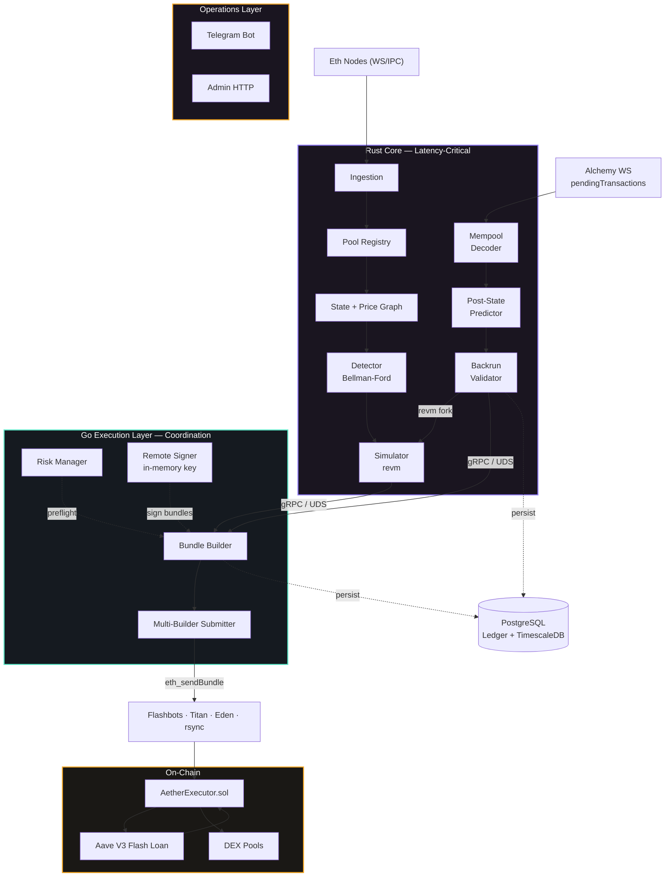
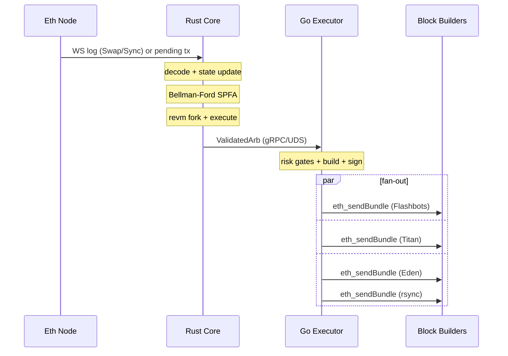
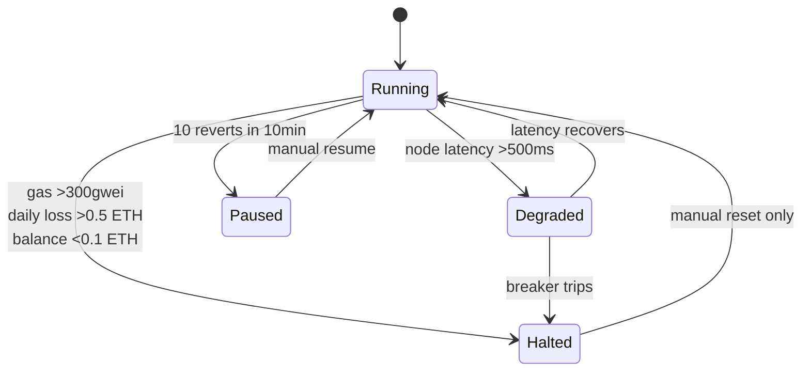

# Aether

**Production-grade, cross-DEX arbitrage engine for Ethereum Mainnet.**

Multi-DEX arbitrage detection across Uniswap V2/V3, SushiSwap, Curve, Balancer, Bancor, 1inch v6, and the Uniswap Universal Router — with Flashbots-native bundle execution, on-chain simulation via `revm`, mempool-backrun support, and an extensible pool registry.

---

## Features

- **Multi-DEX arbitrage detection** — Bellman-Ford (SPFA + SLF) negative cycle detection across 6+ protocols
- **Mempool backrun** — Decodes pending swaps from Alchemy `alchemy_pendingTransactions`, predicts victim post-state, and atomically backruns via `[victim_tx, arb_tx]` bundles
- **EVM simulation** — Fork-mode `revm` engine validates every opportunity before submission
- **Flash loan execution** — Aave V3 `flashLoanSimple` with no upfront capital
- **Multi-builder submission** — Fan-out to Flashbots, Titan, Eden, rsync concurrently
- **Risk management** — Automatic circuit breakers, position limits, system state machine
- **Observability** — Prometheus, Grafana, Loki, Tempo, Alertmanager, Telegram dashboard
- **Extensible pool registry** — New DEX = implement one Rust `Pool` trait + one Solidity swap function

---

## Tech Stack

| Layer | Language | Key Libraries |
|---|---|---|
| Data Ingestion & ABI Parsing | **Rust** | `tokio`, `alloy`, WebSocket |
| Pool State Management | **Rust** | `DashMap`, arena allocators |
| Arbitrage Detection | **Rust** | Bellman-Ford (SPFA), SIMD math |
| EVM Simulation | **Rust** | `revm` (fork mode) |
| Mempool Tracking | **Rust** | Alchemy `alchemy_pendingTransactions`, calldata decoders |
| Caches | **Rust** | `redb` (bytecode disk cache), `DashMap` (WS-fed V2 reserves) |
| Bundle Construction & Submission | **Go** | `go-ethereum`, `flashbotsrpc` |
| Risk Management & Circuit Breakers | **Go** | Stateful controllers, `sync/atomic` |
| Monitoring & API | **Go** | Prometheus, gRPC, Telegram bot |
| Remote Signer | **Go** | AES-256-GCM encrypted key over Unix socket |
| On-Chain Executor | **Solidity** | Aave V3 Flash Loans, OpenZeppelin `Ownable2Step`, `AccessControl`, `ReentrancyGuard` |
| Inter-Service Communication | Both | gRPC + Protobuf over Unix Domain Sockets |
| Persistence | — | PostgreSQL (trade ledger, mempool predictions, metrics) |
| Observability | — | Prometheus, Grafana, Loki, Tempo (OpenTelemetry) |
| Alerting | — | PagerDuty, Telegram, Discord |

---

## Architecture

Two execution paths share the same downstream: the block-driven detector and the mempool-backrun pipeline.



### Execution Flow



---

## Mempool Backrun Mode

Alongside block-driven cyclic arbitrage, Aether runs a pending-transaction backrun strategy:

1. **Decode pending swaps** — an Alchemy `pendingTransactions` subscription feeds a calldata decoder that understands Uniswap V2/V3 routers, SushiSwap, the Uniswap **Universal Router**, **1inch v6** AggregationRouter, Balancer V2 Vault, Bancor V3, and Curve (pool-direct) flows.
2. **Predict victim post-state** — the affected pools are advanced past the victim swap either analytically (Curve, Bancor) or by replaying the swap in `revm` (Balancer, UniV3), producing the reserves the block will actually settle with.
3. **Validate the backrun** — the detector/simulator search for a profitable backrun against that predicted state, with the `AetherExecutor` bytecode injected into the `revm` `CacheDB` so the flash-loan path is exercised.
4. **Bundle atomically** — the bundle is `[victim_raw_tx, arb_tx]`, where `victim_raw_tx` is the victim's raw signed transaction captured from the mempool, so the backrun only lands if the victim lands.

The path is shadow-gated by default (`AETHER_SHADOW`): it logs and dumps forensics instead of submitting until explicitly promoted.

---

## Repository Structure

```
aether/
├── Cargo.toml                       # Rust workspace root
├── go.mod                           # Go module root
├── rust-toolchain.toml              # Rust toolchain pinning
├── proto/
│   └── aether.proto                 # Shared Protobuf schema (gRPC contract)
│
├── crates/                          # ── Rust Crates ──
│   ├── ingestion/                   # WS event + Alchemy mempool subscription
│   ├── pools/                       # DEX pool implementations + router decoders
│   ├── state/                       # Price graph, MVCC snapshots
│   ├── detector/                    # Bellman-Ford (SPFA) cycle detection + gas models
│   ├── simulator/                   # revm fork sim + caches + mempool backrun validator
│   ├── grpc-server/                 # tonic gRPC server (main binary entry point)
│   ├── common/                      # Shared types, Protobuf bindings, DB schema
│   ├── discovery/                   # Factory-event pool discovery + hot cache
│   └── integration-tests/           # Cross-crate integration test suite
│
├── cmd/                             # ── Go Services ──
│   ├── executor/                    # Bundle construction & multi-builder submission
│   ├── monitor/                     # Prometheus metrics, HTTP dashboard, alerting
│   ├── reconciler/                  # Mempool prediction outcome reconciler
│   ├── signer/                      # Remote signing daemon (AES-256-GCM encrypted key)
│   └── telebot/                     # Telegram bot with live metrics & admin controls
│
├── internal/                        # ── Go Shared Packages ──
│   ├── config/                      # Config loading (YAML/TOML) & validation
│   ├── db/                          # Postgres trade/mempool ledger
│   ├── grpc/                        # gRPC client to the Rust core
│   ├── pb/                          # Generated protobuf bindings
│   ├── risk/                        # Circuit breakers, preflight checks, state machine
│   ├── signer/                      # Remote signer client
│   ├── tracing/                     # OpenTelemetry / structured logging
│   ├── events/                      # Redis pub/sub event publishing
│   ├── metrics/                     # Prometheus metric definitions
│   ├── strategy/                    # Strategy classification & selection
│   └── testutil/                    # Test fixtures & helpers
│
├── contracts/                       # ── Solidity ──
│   ├── src/AetherExecutor.sol       # Flashloan receiver + multi-DEX swap router
│   ├── test/
│   │   ├── AetherExecutor.t.sol     # Unit tests (80+ tests, 30+ mocks)
│   │   ├── AetherExecutor.fork.t.sol # Mainnet fork integration tests
│   │   ├── AetherExecutor.invariant.t.sol # Invariant/post-condition tests
│   │   ├── Deploy.t.sol             # Deployment script tests
│   │   ├── ExecutorRoles.t.sol      # Role/access-control tests
│   │   └── echidna/
│   │       └── EchidnaAether.sol    # Echidna fuzzing harness
│   ├── script/Deploy.s.sol          # Foundry deployment script
│   ├── echidna.yaml                 # Echidna fuzzer configuration
│   ├── slither.config.json          # Slither static analyzer configuration
│   └── foundry.toml                 # Foundry project configuration
│
├── config/                          # Runtime configuration
│   ├── pools.toml                   # Pool registry (130+ pools, hot-reloadable)
│   ├── pools_staging.toml           # Reduced registry for staging
│   ├── pools_historical_replay.toml # Snapshot used by replay tooling
│   ├── pools_shadow.toml            # Shadow-mode registry
│   ├── discovery.toml               # Factory-event discovery service config
│   ├── risk.yaml                    # Risk parameters & circuit breaker thresholds
│   ├── nodes.yaml                   # Ethereum node provider endpoints
│   ├── builders.yaml                # Block builder API endpoints
│   ├── executor.yaml                # Bundle build + tip parameters
│   ├── signer.yaml                  # Remote signer socket & key config
│   └── production.toml              # Cross-service production configuration
│
├── migrations/                      # Postgres schema migrations
│   └── 0001-0008                    # Trade ledger, mempool predictions,
│                                    # reconciliation, profitability, TimescaleDB,
│                                    # metrics, dashboard views
│
├── deploy/
│   ├── systemd/                     # aether-rust.service, aether-go.service
│   ├── ansible/                     # Server provisioning playbooks + inventory
│   ├── docker/                      # Docker Compose (dev/prod/e2e), Dockerfiles,
│   │                                # Prometheus/Grafana/Loki/Tempo/Alertmanager config,
│   │                                # Grafana dashboards (8 dashboards)
│   └── remote-deploy.sh             # Remote deployment script
│
├── scripts/                         # ── Tooling ──
│   ├── deploy.sh                    # Build, test, deploy automation
│   ├── shadow_mode_live.sh          # Full production pipeline in shadow mode
│   ├── historical_replay_e2e.sh     # Replay past blocks against current pipeline
│   ├── staging_test.sh              # Staging end-to-end validation
│   ├── mempool_capture.sh           # Capture raw pending-tx stream
│   ├── mempool_smoke.sh             # Mempool path smoke test
│   ├── mempool_backrun_shadow.sh    # Shadow-mode mempool backrun orchestrator
│   ├── test_integration.sh          # Cross-language gRPC integration tests
│   ├── test_replay.sh               # Historical mainnet replay tests
│   ├── run_fork_tests.sh            # Anvil-fork integration tests
│   ├── backtest.py                  # Historical opportunity analysis
│   ├── gas_profiler.py              # Gas usage profiling
│   ├── canary.py                    # Scrape-staleness canary
│   ├── load_test.sh                 # High-frequency detection cycle simulation
│   ├── watchdog.sh                  # Anvil fork watchdog
│   ├── db_migrate.sh                # Postgres schema migrations
│   ├── encrypt_key.sh               # Private key encryption
│   ├── monitoring_smoke.sh          # Monitoring stack smoke test
│   └── coverage_check.sh            # Coverage validation scripts
│
├── fuzz/                            # Rust fuzz targets (cargo-fuzz / libfuzzer)
├── tests/                           # Go integration, E2E, and load tests
│
├── docs/
│   ├── architecture.md              # System architecture deep dive
│   ├── runbook.md                   # Operational procedures
│   ├── production_runbook.md        # Production startup and troubleshooting
│   ├── incident-response.md         # SEV1–SEV4 incident playbooks
│   ├── e2e_testing.md               # E2E test guide
│   ├── redis_events.md              # Redis pub/sub event documentation
│   ├── telegram_dashboard.md        # Telegram bot setup and commands
│   ├── discovery_service.md         # Pool discovery service docs
│   ├── research/                    # Tx ordering, builder matrix, strategy analysis
│   ├── issues/staged/               # Staged issue bodies for upcoming workstreams
│   └── runbook/                     # Mempool, AB selector, shutdown, recovery, alerts
│
└── .github/workflows/               # ── CI/CD Pipelines ──
    ├── ci.yml                       # On-chain (Solidity) CI
    ├── offchain-ci.yml              # Off-chain (Go + Rust) CI
    ├── offchain-cd.yml              # Off-chain (Go + Rust) CD
    ├── e2e.yml                      # End-to-end stack tests
    ├── metamask-sepolia.yml         # MetaMask Sepolia testnet testing
    └── deploy-docs.yml              # Documentation deployment
```

---

## Prerequisites

- **Rust** 1.81+ (via [rustup](https://rustup.rs/))
- **Go** 1.22+ (see `go.mod`)
- **Foundry** ([forge, cast, anvil](https://getfoundry.sh/))
- **Protobuf compiler** (`protoc`)
- **Docker & Docker Compose** (local infrastructure)
- **PostgreSQL** 15+ (trade ledger; optional in dev)

---

## Build

```bash
# Rust core
cargo build --release

# Go services
go build -o bin/aether-executor  ./cmd/executor
go build -o bin/aether-monitor   ./cmd/monitor
go build -o bin/aether-reconciler ./cmd/reconciler
go build -o bin/aether-signer    ./cmd/signer
go build -o bin/aether-telebot   ./cmd/telebot

# Solidity contracts
cd contracts && forge build

# All at once
./scripts/deploy.sh build
```

For production Rust with LTO:

```bash
RUSTFLAGS="-C target-cpu=native" cargo build --release
```

---

## Test

```bash
# Rust unit tests
cargo test --workspace --locked

# Rust clippy
cargo clippy --workspace -- -D warnings

# Go tests
go test ./...

# Go with coverage
go test ./... -coverprofile=coverage.out
go tool cover -func=coverage.out | tail -30

# Solidity unit tests
cd contracts && forge test -vvv

# Solidity fuzz tests
cd contracts && forge test --fuzz-runs 1000 -vvv

# Solidity invariant tests
cd contracts && forge test --match-path "test/*.invariant.t.sol" -vvv

# Fork tests (requires ETH_RPC_URL)
./scripts/run_fork_tests.sh

# Cross-language gRPC integration tests
./scripts/test_integration.sh

# Historical replay tests
./scripts/test_replay.sh

# Full staging validation
./scripts/staging_test.sh
```

### Test Types Implemented

| Type | Scope | Tool |
|---|---|---|
| Unit tests | Rust crates, Go packages, Solidity contracts | `cargo test`, `go test`, `forge test` |
| Integration tests | Cross-language gRPC, Postgres, pipeline | Go integration tags + Rust integration crate |
| Fork tests | Mainnet fork via Anvil | Foundry fork tests |
| Invariant tests | Solidity post-condition safety properties | Foundry invariant runner |
| Fuzz tests | Rust libfuzzer targets, Solidity fuzz tests | `cargo-fuzz`, `forge test --fuzz` |
| Echidna fuzzing | Formal property-based Solidity fuzzing | Echidna |
| Load / stress tests | Detection cycle simulation | Go load test suite |
| E2E tests | Full pipeline against Docker Compose stack | Go E2E test suite |

---

## CI/CD

The project uses GitHub Actions with three pipeline families:

### On-Chain (Solidity) — `.github/workflows/ci.yml`

Triggered on push/PR to `main`. Runs Foundry-based validation:

- `forge build` — compilation with warnings-as-errors
- `forge test` — unit + invariant tests
- Coverage generation with ≥98% threshold
- Slither static analysis (fail on High/Medium)
- Solhint linting
- Semgrep security scanning
- Echidna property-based fuzzing
- Anvil mainnet fork integration tests

### Off-Chain (Go + Rust) — `.github/workflows/offchain-ci.yml`

Triggered on push/PR to `main`. Runs:

- `gofmt` formatting check
- `go vet` + `staticcheck` static analysis
- `cargo fmt` + `cargo clippy` linting
- Go coverage (≥97%) + Rust coverage (≥98%)
- Integration tests
- Rust + Go fuzz tests
- Load / stress tests
- E2E tests

### Off-Chain CD — `.github/workflows/offchain-cd.yml`

Triggered on push to `main`. Same validations as CI plus Docker image build and push to `ghcr.io`.

---

## Configuration

All configuration lives in `config/`:

| File | Purpose | Hot-Reload |
|---|---|---|
| `pools.toml` | Pool registry — 130+ monitored DEX pools | Yes (gRPC `ReloadConfig`) |
| `discovery.toml` | Factory-event discovery service | Yes |
| `risk.yaml` | Risk parameters & circuit breaker thresholds | No (restart) |
| `nodes.yaml` | Ethereum node provider endpoints | No |
| `builders.yaml` | Block builder API endpoints & auth | No |
| `executor.yaml` | Bundle build + tip parameters | No |
| `signer.yaml` | Remote signer socket & key file path | No |
| `production.toml` | Cross-service production settings | No |

### Key Environment Variables

| Variable | Purpose |
|---|---|
| `ETH_RPC_URL` | Primary RPC endpoint (WS preferred) |
| `AETHER_POOLS_CONFIG` | Override path to `config/pools.toml` |
| `DATABASE_URL` | Trade ledger DSN (omit → `NoopLedger`) |
| `MEMPOOL_TRACKING=1` | Enable Alchemy mempool subscription |
| `MEMPOOL_BACKRUN_SHADOW=1` | Run backrun validator without submitting |
| `AETHER_EXECUTOR_ADDRESS` | Executor contract address |
| `AETHER_SHADOW=1` | Global shadow mode — no real submissions |
| `LOG_FORMAT=json` | JSON log formatter |
| `OTEL_EXPORTER_OTLP_ENDPOINT` | OTel endpoint for Tempo |

---

## Running

### Local Development (Docker Compose)

```bash
./scripts/deploy.sh docker up
```

Starts: `aether-rust`, `aether-go`, Prometheus, Grafana, Loki, Tempo, Alertmanager.

### Manual Start

```bash
# 1. Infrastructure
docker compose -f deploy/docker/docker-compose.yml up -d prometheus grafana loki

# 2. Rust core
cargo run --release --bin aether-rust

# 3. Go executor
go run ./cmd/executor

# 4. Monitor
go run ./cmd/monitor
```

### Production

```bash
./scripts/deploy.sh deploy staging
./scripts/deploy.sh deploy production
./scripts/deploy.sh status production
./scripts/deploy.sh rollback production
```

---

## Cache Layers

Three caches reduce per-simulation RPC traffic:

| Cache | Mechanism | Impact |
|---|---|---|
| Pre-warm throttle | `tokio::Semaphore` (default 8) | Prevents 429s from burst RPCs |
| Bytecode disk cache | `redb` on disk | Eliminates repeat `eth_getCode` calls |
| V2 reserves WS cache | `Sync` event stream | Eliminates repeat `eth_getStorageAt` for warm pools |

All caches degrade gracefully — a miss or failure falls back to the RPC path.

---

## Expected Performance Characteristics

The following are expected characteristics based on implementation analysis, not measured benchmarks:

| Stage | Expected Range |
|---|---|
| Event decode + state update | Sub-millisecond per event |
| Bellman-Ford SPFA detection | Low single-digit milliseconds |
| revm fork simulation (cache-warm) | Low single-digit milliseconds |
| gRPC Rust → Go | Microsecond (Unix Domain Socket) |
| Bundle build + sign | Low single-digit milliseconds |

Actual performance depends on hardware, network latency, block complexity, and pool configuration.

---

## Risk Management

Automatic circuit breakers enforce system safety:

| Condition | Action |
|---|---|
| Gas price >300 gwei | **HALT** |
| 10 consecutive reverts in 10min | **PAUSE** |
| Daily loss >0.5 ETH | **HALT** |
| ETH balance <0.1 ETH | **HALT** |
| Node latency >500ms | **DEGRADE** |
| Bundle miss rate >80% in 1h | **ALERT** |

State machine:



---

## Monitoring

Prometheus metrics on port 9090 (`/metrics`):

- `aether_opportunities_detected_total` — Arbitrage opportunities found
- `aether_mempool_pending_arb_candidates_total` — Mempool candidates
- `aether_bundles_included_total` — Bundles included on-chain
- `aether_detection_latency_ms` — Detection pipeline latency
- `aether_end_to_end_latency_ms` — Full pipeline latency
- `aether_gas_price_gwei` — Current gas price
- `aether_daily_pnl_eth` — Daily profit & loss
- `aether_eth_balance` — Searcher wallet balance
- `aether_decode_errors_total` — Calldata decode failures

Alerts via PagerDuty, Telegram, Discord. Pre-configured Grafana dashboards: overview, mempool, builders, latency, risk, SLI, cache, backrun funnel.

---

## Adding a New DEX

1. Implement the `Pool` trait in `crates/pools/src/<new_dex>.rs`
2. Add event signature to `crates/ingestion/src/event_decoder.rs`
3. Add protocol variant to `ProtocolType` in `crates/common/src/types.rs`
4. Add swap routing in `contracts/src/AetherExecutor.sol` `_executeSwap()`
5. Add gas estimate in `crates/detector/src/gas.rs`
6. Add pool config entry in `config/pools.toml`
7. (Optional) add calldata decoder in `crates/pools/src/router_decoder.rs`

No changes needed to detection or execution logic.

---

## Security

- Flashloan-backed — no upfront capital at risk
- Searcher EOA holds minimal ETH (~0.5 ETH for gas)
- Profits swept to cold wallet periodically
- Private keys encrypted with AES-256-GCM, loaded by remote signer daemon
- `AetherExecutor` uses OpenZeppelin `Ownable2Step` + `AccessControl` — role-based access for executor/pauser/admin
- Timelocked router updates (24h/48h) prevent instantaneous DEX router changes
- Per-protocol kill switches
- `renounceOwnership()` permanently disabled
- Network hardening via iptables and WireGuard VPN

---

## Documentation

- [`docs/architecture.md`](docs/architecture.md) — System architecture deep dive
- [`docs/runbook.md`](docs/runbook.md) — Operational procedures
- [`docs/production_runbook.md`](docs/production_runbook.md) — Production startup guide
- [`docs/incident-response.md`](docs/incident-response.md) — Incident playbooks
- [`docs/e2e_testing.md`](docs/e2e_testing.md) — E2E test guide
- [`docs/telegram_dashboard.md`](docs/telegram_dashboard.md) — Telegram bot setup
- [`docs/redis_events.md`](docs/redis_events.md) — Redis pub/sub schemas
- [`docs/discovery_service.md`](docs/discovery_service.md) — Dynamic pool discovery
- [`docs/runbook/mempool-backrun-rollout.md`](docs/runbook/mempool-backrun-rollout.md) — Shadow → canary → live rollout
- [`docs/runbook/mempool-observability.md`](docs/runbook/mempool-observability.md) — Mempool observability
- [`docs/research/builder-matrix.md`](docs/research/builder-matrix.md) — Builder integration
- [`docs/research/tx-ordering-strategy.md`](docs/research/tx-ordering-strategy.md) — Backrun ordering analysis
- [`docs/research/strategy-class-analysis.md`](docs/research/strategy-class-analysis.md) — Strategy taxonomy
- [`docs/perf/cargo-release-profile.md`](docs/perf/cargo-release-profile.md) — Release tuning
