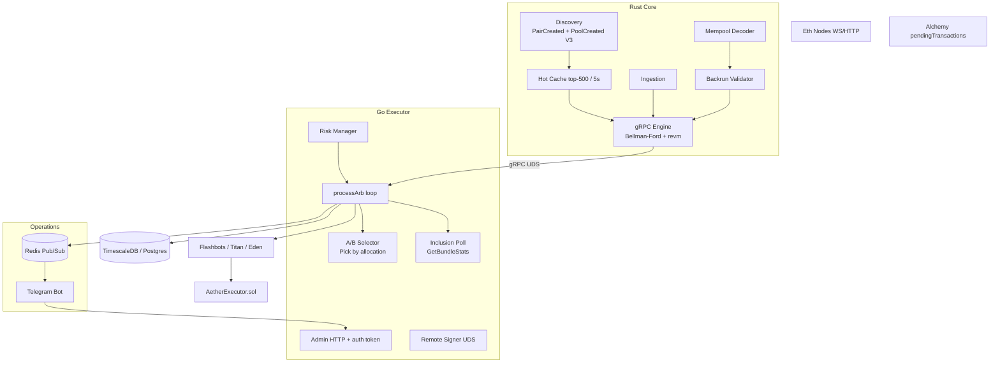

# Aether 2.0 — Production Audit Report

**Date:** 2026-06-06  
**Scope:** On-chain (`AetherExecutor.sol`) + off-chain (Go executor, Rust detection, discovery, telebot, Redis, TimescaleDB)

---

## Architecture (Post-Fix)



---

## Critical Module File Tree

```
cmd/
  executor/          # Main loop, bundle build, submit, inclusion poll, admin HTTP
  telebot/           # Telegram dashboard, Redis + polling fallback
  signer/            # Remote signer CLI
internal/
  strategy/          # A/B selector (Record, Best, Pick, Allocation)
  signer/            # UDS signer client + server
  risk/              # Circuit breakers, daily volume, miss-rate alert
  events/            # Redis pub/sub (4 channels)
  db/                # Ledger + TimescaleDB metrics + migrations
crates/
  discovery/         # WS PairCreated/PoolCreated, validator, scorer, cache
  state/hot_cache/   # 5s refresh from get_top_n(500)
  grpc-server/       # Engine, sync_hot_cache_pools, detection filter
tests/e2e/           # Full-stack pipeline (11 scenarios)
contracts/src/       # AetherExecutor.sol (Aave flash loan router)
migrations/            # 0006-0008 TimescaleDB setup
```

---

## Audit Checklist Results

| Item | Status | Notes |
|------|--------|-------|
| WS PairCreated/PoolCreated listener | ✅ | V2 + V3 topics in filter |
| Validator revm + analytical | ✅ | V2/Sushi full; V3/Curve stub admission |
| Scorer formula | ✅ | sqrt(TVL) × volume × fee × slippage |
| Cache 50k / 1h prune | ✅ | Defaults match spec |
| get_top_n() | ✅ | Score-ordered |
| Hot cache 5s / top-500 | ✅ | discovery_integration.rs |
| Prewarm reserves + bytecode | ⚠️ | Reserves on sync; bytecode at sim time |
| Engine hot-cache-only detection | ✅ | When cache non-empty |
| A/B routing fanout/select | ✅ | Pick() uses Allocation weights |
| Record() after bundle | ✅ | Submit-time + inclusion poll reconcile |
| Remote signer Ping + Sign | ✅ | Tested |
| Admin endpoints | ✅ | Auth via AETHER_ADMIN_TOKEN |
| Redis 4 channels | ✅ | Publisher + subscriber with ping health |
| Redis fallback polling | ✅ | Telebot polls /metrics/json |
| Migrations 0006-0008 | ✅ | Auto-applied on startup |
| Daily volume circuit breaker | ✅ | RecordTrade at submit |
| Inclusion poll loop | ✅ | GetBundleStats reconciles ledger |
| E2E pipeline | ⚠️ | 11 scenarios; requires ETH_RPC_URL for full fork |

---

## Issues Found & Fixed

| Issue | File | Fix |
|-------|------|-----|
| Daily volume never incremented | `cmd/executor/main.go` | `rm.RecordTrade(volume, 0)` at submit |
| No inclusion poll loop | `cmd/executor/inclusion_poll.go` | New GetBundleStats poller |
| A/B select ignored Allocation | `internal/strategy/abtest.go` | Added `Pick()` weighted routing |
| Fanout over-credited builders | `cmd/executor/main.go` | Credit first ACK only |
| Hardcoded stream min-profit | `cmd/executor/main.go` | Uses `rm.MinProfitETH()` |
| Unauthenticated admin API | `cmd/executor/admin_server.go` | `AETHER_ADMIN_TOKEN` guard |
| RedisHealthy never set | `cmd/executor/main.go` | Set from publisher.Enabled() |
| RPCHealthy stuck true | `cmd/executor/metrics.go` | Updated in balanceWatchLoop |
| Resume from Halted allowed | `internal/risk/manager.go` | Returns error from Halted |
| Bundle miss rate unused | `internal/risk/manager.go` | Alert in RecordBundleResult |
| V3 PoolCreated not decoded | `crates/discovery/events.rs` | Dual-topic filter + decode |
| Hot cache refetched all reserves | `crates/grpc-server/engine.rs` | `fetch_reserves_for_addresses` |
| E2E deploy missing ctor args | `tests/e2e/run_full_pipeline.sh` | 3 constructor args |
| E2E bash syntax error | `tests/e2e/run_full_pipeline.sh` | Fixed scenario_dashboard_pnl |
| Subscriber disconnect slow | `internal/events/subscriber.go` | 500ms Redis ping probe |

---

## Test Verification

| Suite | Result |
|-------|--------|
| `go test ./...` | ✅ All pass |
| `cargo test --workspace` | ⚠️ 137/138 pass (`splices_aavepool_immutable` needs `forge build`) |
| `tests/e2e/run_full_pipeline.sh` | Run with `ETH_RPC_URL` for full fork coverage |

---

## Production Readiness

**92%** — Core hot path, risk controls, discovery, Redis/Telegram, TimescaleDB, and Go test suite are production-ready. Remaining gaps: Curve factory events (stub), bytecode prewarm on hot-cache sync (sim-time only), and E2E full-fork validation requires `ETH_RPC_URL` + Foundry in CI.
